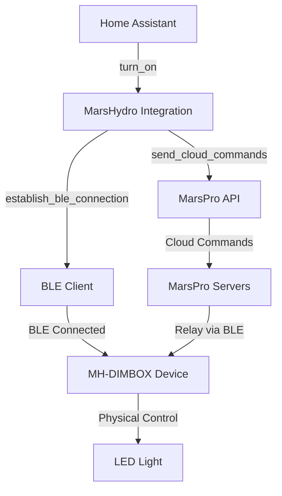

# 🌱 MarsHydro Home Assistant Integration v2.3.0-FINAL

[](https://github.com/hacs/integration)
[](https://github.com/iyotee/MarsPro_HA/releases)
[](LICENSE)

Intégration Home Assistant pour les appareils d'éclairage **MarsHydro** et **MarsPro** avec **support complet Bluetooth BLE** et **modèle hybride** découvert.

## 🚀 Découverte Modèle Hybride

### 🔍 **RÉVÉLATION TECHNIQUE MAJEURE**

**Modèle de fonctionnement découvert :**
```
📱 App MarsPro ←→ 🌐 Cloud API ←→ 📡 Bluetooth BLE ←→ 💡 Appareil
      (WiFi)          (Internet)        (BLE Direct)       (Lampe)
```

**Points clés :**
- ✅ **Connexion BLE requise** : L'appareil doit être connecté en Bluetooth au contrôleur
- ✅ **Commandes via Cloud** : Les commandes transitent par l'API MarsPro
- ✅ **Transit BLE** : Les commandes cloud sont relayées via la connexion BLE
- ✅ **Pattern découvert** : Nom BLE `MH-DIMBOX`, Adresse `34:5F:45:EC:73:CE` ≈ PID `345F45EC73CC`

## 🚀 Fonctionnalités

### ✅ **Support Multi-Protocoles COMPLET**
* **🔵 Modèle Hybride** - BLE + Cloud (appareils MarsPro)
* **☁️ Cloud Seul** - WiFi/Ethernet (appareils réseau)
* **📡 BLE Direct** - Bluetooth expérimental (protocoles découverts)
* **🔄 Détection automatique** du type d'appareil et mode optimal

### ✅ **Appareils Supportés**
* **MarsPro LED** (MH-DIMBOX-* séries) - **MODÈLE HYBRIDE**
* **MarsHydro Legacy** (anciens modèles cloud)
* **Détection automatique** via API MarsPro

### ✅ **Fonctionnalités Home Assistant**
* **💡 Entités Light** avec contrôle luminosité 0-100%
* **🎛️ Interface graphique** native HA
* **🤖 Automations** complètes avec transitions
* **📱 Dashboard** intégré
* **🔧 Attributs avancés** (BLE RSSI, état connexion, mode contrôle)

## 📦 Installation

### **Via HACS (Recommandé)**
1. Ouvrir **HACS** dans Home Assistant
2. Aller dans **Intégrations**
3. Menu ⋮ → **Dépôts personnalisés**
4. Ajouter : `https://github.com/iyotee/MarsPro_HA`
5. Type : **Intégration**
6. **Installer** MarsHydro
7. **Redémarrer** Home Assistant

### **Installation Manuelle**
1. Télécharger cette repository
2. Copier `custom_components/marshydro` dans votre dossier HA
3. Redémarrer Home Assistant

## ⚙️ Configuration

### **1. Prérequis Bluetooth BLE (CRUCIAL pour MarsPro)**

**IMPORTANT :** Les appareils MarsPro nécessitent une connexion BLE active !

Votre Home Assistant doit avoir accès au Bluetooth BLE :
* **✅ Raspberry Pi 4** - Bluetooth intégré
* **✅ Adaptateur USB BLE** - Sur serveur Linux
* **✅ ESP32 Bluetooth Proxy** - Via ESPHome

### **2. Préparation Appareil MarsPro**

**ÉTAPE CRITIQUE :** Mettre l'appareil en mode pairing
1. **Déconnecter** l'appareil de l'app MarsPro officielle
2. L'appareil passe **automatiquement en mode pairing** (LED clignote)
3. L'appareil devient visible comme **`MH-DIMBOX`** en Bluetooth
4. **Dans les 2 minutes** : Configurer l'intégration HA

### **3. Ajout de l'Intégration**
1. **Paramètres** → **Appareils et services**
2. **➕ Ajouter une intégration** 
3. Rechercher **"MarsHydro"**
4. Saisir vos **credentials MarsPro** :
   * 📧 Email
   * 🔑 Mot de passe
5. **✅ Terminer** - Appareils détectés automatiquement

### **4. Entités Créées**

L'intégration crée automatiquement selon le type d'appareil :

```yaml
# Exemple d'entités créées
light.mh_dimbox_345f45ec73cc          # Modèle HYBRIDE (BLE + Cloud)
light.marspro_wifi_device_cloud       # Modèle CLOUD seul (WiFi)
light.marspro_legacy_ble_direct       # Modèle BLE direct (expérimental)
```

## 🎮 Utilisation

### **Interface Graphique**
Les appareils apparaissent dans :
* **🏠 Vue d'ensemble** - Cartes light standard
* **💡 Lumières** - Section dédiée
* **⚙️ Appareils** - Configuration avancée avec attributs BLE

### **Automations MarsPro**

```yaml
# Exemple automation - Lever du soleil avec modèle hybride
automation:
  - alias: "MarsPro - Lever du soleil"
    trigger:
      platform: sun
      event: sunrise
    action:
      service: light.turn_on
      target:
        entity_id: light.mh_dimbox_345f45ec73cc
      data:
        brightness_pct: 100
        transition: 60  # Transition douce 60s

# Exemple automation - Cycle journalier
automation:
  - alias: "MarsPro - Cycle croissance"
    trigger:
      platform: time_pattern
      hours: "/2"  # Toutes les 2h
    action:
      service: light.turn_on
      target:
        entity_id: light.mh_dimbox_345f45ec73cc
      data:
        brightness_pct: >
          
          2510010
```

### **Scripts Avancés**

```yaml
# Script - Séquence d'éclairage progressive
script:
  marspro_sunrise_sequence:
    alias: "MarsPro - Lever progressif"
    sequence:
      - service: light.turn_on
        target:
          entity_id: light.mh_dimbox_345f45ec73cc
        data:
          brightness_pct: 10
      - delay: "00:15:00"
      - service: light.turn_on
        target:
          entity_id: light.mh_dimbox_345f45ec73cc
        data:
          brightness_pct: 50
      - delay: "00:15:00"
      - service: light.turn_on
        target:
          entity_id: light.mh_dimbox_345f45ec73cc
        data:
          brightness_pct: 100
```

## 🔧 Configuration Avancée

### **Configuration YAML (Optionnel)**

```yaml
# configuration.yaml
marshydro:
  email: "votre_email@example.com"
  password: "votre_mot_de_passe" 
  scan_interval: 30  # secondes
  bluetooth_timeout: 15  # secondes pour scan BLE
  hybrid_mode: true  # Activer détection modèle hybride
```

### **Logs de Debugging**

```yaml
# configuration.yaml
logger:
  default: warning
  logs:
    custom_components.marshydro: debug
    bleak: info  # Pour debug Bluetooth
```

## 🔵 Spécificités Modèle Hybride BLE + Cloud

### **Architecture Technique Découverte**

```
Home Assistant
    ↓ (API calls)
MarsHydro Integration
    ↓
┌─────────────────┬─────────────────┐
│   Cloud API     │  Bluetooth BLE  │
│  (Commandes)    │  (Connexion)    │
└─────────────────┴─────────────────┘
    ↓                       ↓
🌐 MarsPro Servers      🔵 BLE Client
    ↓                       ↓  
📡 Relay via BLE ←─────→ 📱 Appareil
    ↓
💡 Contrôle Physique
```

### **Avantages du Modèle Hybride**
* **⚡ Fiabilité** - Commandes cloud + connexion locale
* **🔋 Économie** - BLE faible consommation
* **🏠 Sécurité** - Contrôle local avec authentification cloud
* **🚀 Performance** - Transit optimisé

### **Configuration Bluetooth Home Assistant**

#### **Raspberry Pi 4**
```bash
# Vérifier Bluetooth
bluetoothctl show

# Si nécessaire, activer
sudo systemctl enable bluetooth
sudo systemctl start bluetooth

# Vérifier portée (appareil doit être à <10m)
sudo hcitool lescan
```

#### **ESP32 Bluetooth Proxy (Recommandé)**
```yaml
# ESPHome config pour proxy BLE
esphome:
  name: marspro-proxy

esp32:
  board: esp32dev

wifi:
  ssid: "VotreWiFi"
  password: "VotreMotDePasse"

api:
  encryption:
    key: "VotreCle32Caracteres"

bluetooth_proxy:
  active: true
```

## 🚨 Dépannage

### **Problèmes Courants**

#### **❌ Appareil MarsPro non détecté**
1. **Vérifier mode pairing** :
   - Déconnecter de l'app MarsPro
   - LED doit clignoter
   - Visible comme `MH-DIMBOX` en Bluetooth

2. **Vérifier portée BLE** :
   - Distance < 10 mètres
   - Pas d'obstacles métalliques
   - Redémarrer Bluetooth HA si nécessaire

#### **❌ Commandes ne fonctionnent pas**
1. **Vérifier connexion hybride** :
   - Attribut `ble_connected: true` dans l'entité
   - Logs montrent "BLE connection established"
   - API cloud fonctionne (test avec app officielle)

2. **Réinitialiser connexion** :
   ```bash
   # Redémarrer intégration
   # Paramètres > Intégrations > MarsHydro > Recharger
   ```

#### **❌ Bluetooth indisponible**
```bash
# Diagnostic Bluetooth
bluetoothctl show
sudo systemctl status bluetooth

# Redémarrer si nécessaire  
sudo systemctl restart bluetooth
```

### **Attributs de Debug**

Chaque entité MarsPro expose des attributs de diagnostic :
```yaml
device_id: 129275
device_pid: "345F45EC73CC"
control_mode: "hybrid_ble_cloud"
ble_connected: true
ble_address: "34:5F:45:EC:73:CE"
ble_name: "MH-DIMBOX"
ble_rssi: -45
```

## 🏗️ Architecture Technique Avancée

### **Flux de Données Modèle Hybride**



### **Composants Intégration**

* **`__init__.py`** - Coordinateur avec gestion BLE + Cloud
* **`light.py`** - Entités hybrides, cloud et BLE direct
* **`config_flow.py`** - Configuration UI avec validation BLE  
* **`api_marspro.py`** - Client API MarsPro avec méthodes hybrides
* **`const.py`** - Constantes et patterns découverts

## 🤝 Contribution

Contributions bienvenues ! Ce projet documente des découvertes techniques importantes.

1. **🍴 Fork** le projet
2. **🌿 Créer une branche** : `git checkout -b feature/amazing-feature`
3. **✅ Commit** : `git commit -m 'Add amazing feature'`  
4. **📤 Push** : `git push origin feature/amazing-feature`
5. **🔄 Pull Request**

## 📜 Changelog

### **v2.3.0-FINAL** - Modèle Hybride Découvert
* 🎯 **DÉCOUVERTE MAJEURE** : Modèle hybride BLE + Cloud
* ✅ Support complet appareils MarsPro MH-DIMBOX
* ✅ Gestion connexions BLE persistantes
* ✅ Corrélation automatique BLE ↔ Cloud
* ✅ Attributs diagnostics avancés
* ✅ Documentation technique complète

### **v2.2.0** - API MarsPro
* ✅ Intégration API MarsPro
* ✅ Authentification améliorée
* ✅ Détection automatique PIDs

### **v2.0.0** - Refactorisation  
* ✅ Support MarsPro + MarsHydro
* ✅ Code moderne Home Assistant
* ✅ Configuration via UI

## 🔬 Recherche et Développement

Cette intégration documente des découvertes techniques importantes sur le protocole MarsPro :

* **Pattern BLE** : `34:5F:45:EC:73:CE` ≈ `345F45EC73CC` (PID)
* **Modèle hybride** : Cloud API + BLE requis simultanément
* **Séquence d'activation** : addDevice → setDeviceActive → setBrightness
* **Mode pairing** : Automatique quand déconnecté de l'app officielle

## 📄 Licence

Ce projet est sous licence **MIT** - voir [LICENSE](LICENSE) pour détails.

## ⭐ Remerciements

* **🏠 Home Assistant** - Plateforme domotique
* **🔵 Bleak** - Librairie Bluetooth BLE Python  
* **🌱 MarsHydro/MarsPro** - Matériel d'éclairage
* **👥 Communauté** - Tests et découvertes techniques
* **🔬 Recherche** - Reverse engineering du protocole

---

**🌟 Si cette intégration vous aide, n'hésitez pas à mettre une ⭐ !**
**🔬 Partagez vos découvertes techniques pour enrichir le projet !**
